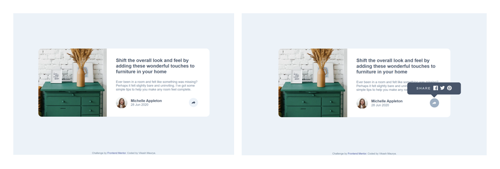
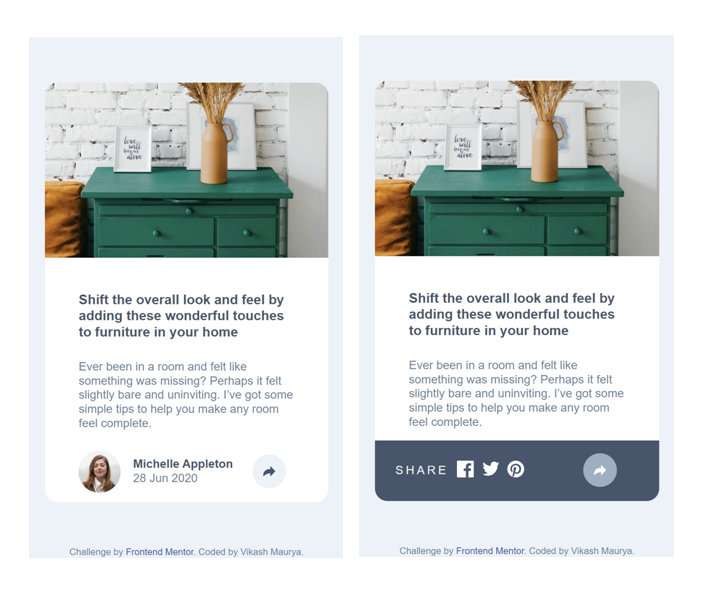

# Frontend Mentor - Article preview component solution

This is a solution to the [Article preview component challenge on Frontend Mentor](https://www.frontendmentor.io/challenges/article-preview-component-dYBN_pYFT).

## Table of contents

- [Overview](#overview)
  - [The challenge](#the-challenge)
  - [Screenshot](#screenshot)
  - [Links](#links)
- [My process](#my-process)
  - [Built with](#built-with)
  - [Useful resources](#useful-resources)
- [Author](#author)

## Overview

### The challenge

Users should be able to:

- View the optimal layout for the component depending on their device's screen size
- See the social media share links when they click the share icon

### Screenshot

### Links

- Solution URL: [get solution🌐](https://github.com/VikashMaurya10/article-preview-component-master)
- Live Site URL: [view🌐](https://vikashmaurya10.github.io/article-preview-component-master/)

## My process

### Built with

- Semantic HTML5 markup
- SCSS custom properties
- Flexbox
- CSS Grid

### Useful resources

- [Figma](https://www.figma.com) - This helped me for measuring the actual design. I really liked this pattern and will use it going forward.

## Author

- Frontend Mentor - [@vikashmaurya](https://www.frontendmentor.io/profile/VikashMaurya10)
- LinkedIn - [@in-vikashmaurya](https://www.linkedin.com/in/in-vikashmaurya)
